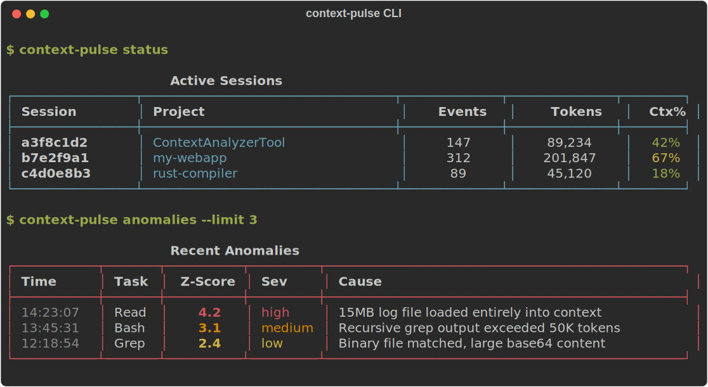

<p align="center">
  
</p>

<p align="center">
  <strong>Know exactly which tool call ate your context window.</strong>
</p>

<p align="center">
  <a href="https://github.com/roeimichael/ContextAnalyzerTerminal/actions/workflows/ci.yml"></a>
  <a href="https://www.python.org/downloads/"></a>
  <a href="LICENSE"></a>
</p>

---

CAT hooks into your Claude Code sessions and tracks token cost **per tool call** -- not just per session. It builds rolling baselines, flags anomalies, and uses an LLM to explain *why* something was expensive.

<p align="center">
  
</p>

<p align="center">
  
</p>

## Install

```bash
git clone https://github.com/roeimichael/ContextAnalyzerTerminal.git
cd ContextAnalyzerTerminal
uv sync

# Optional: enable LLM root-cause classifier (uses Haiku, ~$0.0001/event)
uv sync --extra classifier
```

> **Requires:** Python 3.11+ and [uv](https://docs.astral.sh/uv/)

## Setup & Run

```bash
# Install hooks into Claude Code (also writes default config)
context-analyzer-tool install

# Start the collector (keep running in a terminal)
context-analyzer-tool serve

# Open the dashboard
context-analyzer-tool dashboard
```

That's it. Use Claude Code normally -- CAT tracks everything in the background.

## What You Get

| Feature | What it does |
|:--------|:-------------|
| **Per-tool-call tracking** | See exactly how many tokens each Read, Bash, Grep, etc. costs |
| **Rolling baselines** | Learns normal cost per task type using Welford's algorithm |
| **Anomaly detection** | Flags tool calls that exceed baseline by configurable Z-score |
| **Root-cause analysis** | Haiku classifier explains *why* in plain language |
| **Context cost breakdown** | See fresh-session vs current overhead ratio |
| **Live dashboard** | Rich TUI with sessions, cost timeline, and anomaly feed |
| **Notifications** | Statusline badges, system alerts, Slack/Discord webhooks |
| **Multi-session** | Tracks concurrent Claude Code sessions independently |

<p align="center">
  
</p>

## CLI Reference

```
context-analyzer-tool install         Install hooks into Claude Code
context-analyzer-tool uninstall       Remove hooks from Claude Code
context-analyzer-tool serve           Start the collector server
context-analyzer-tool dashboard       Launch the live TUI dashboard
context-analyzer-tool status          View active sessions and recent tasks
context-analyzer-tool anomalies       List recent anomalies with root causes
context-analyzer-tool context-cost    Show context cost breakdown
context-analyzer-tool health          Collector health check
context-analyzer-tool rtk-status      Show RTK integration status and savings
context-analyzer-tool prune           Clean up old data
context-analyzer-tool clear           Clear all stored data and start fresh
```

## Configuration

Config lives at `~/.context-analyzer-tool/config.toml` (created automatically on first `install`). Every setting can be overridden with environment variables using the `CAT_` prefix.

```toml
[collector]
host = "127.0.0.1"
port = 7821

[anomaly]
z_score_threshold = 2.0      # Std devs above mean to flag
min_sample_count = 5          # Data points before detection kicks in
cooldown_seconds = 60         # Debounce duplicate alerts

[classifier]
enabled = true                # Requires: uv sync --extra classifier
model = "claude-haiku-4-5-20251001"

[notifications]
statusline = true             # Badge in Claude Code statusline
system_notification = true    # OS notifications (macOS/Linux)
in_session_alert = true       # In-session alert messages
webhook_url = ""              # Slack/Discord webhook
```

Environment variable overrides:
```bash
CAT_COLLECTOR_PORT=8080
CAT_ANOMALY_Z_SCORE_THRESHOLD=3.0
CAT_CLASSIFIER_ENABLED=false
```

## How It Works

Claude Code hooks don't include token counts. CAT correlates two data streams:

1. **Hook events** (PostToolUse, SubagentStop, Stop, etc.) carry tool metadata
2. **Statusline snapshots** provide real-time token counts

The delta engine matches them by session ID + timestamps to compute per-call costs. Anomalies are detected via Z-score over a rolling 20-sample window per task type, then classified by Haiku.

```
Hooks + Statusline --> Collector --> Delta Engine --> Anomaly Detection --> Classifier --> Notifications
                                        |
                                    SQLite DB
                                        |
                                    Dashboard
```

## Contributing

We welcome contributions! Check out our **[Good First Issues](https://github.com/roeimichael/ContextAnalyzerTerminal/labels/good%20first%20issue)** for beginner-friendly tasks with clear guidance.

```bash
uv sync --all-extras          # Install with dev + classifier deps
uv run pytest tests/ -v       # Run full test suite
uv run ruff check src tests   # Lint
uv run pyright                # Type check (strict mode)
```

See [CONTRIBUTING.md](CONTRIBUTING.md) for architecture overview, reading order, and contribution guidelines.

## Tech Stack

**FastAPI** + **Uvicorn** (async collector) -- **SQLite** + **aiosqlite** (persistence) -- **Pydantic** (validation) -- **Typer** + **Rich** (CLI/TUI) -- **Anthropic SDK** (optional classifier)

## License

[MIT](LICENSE)
