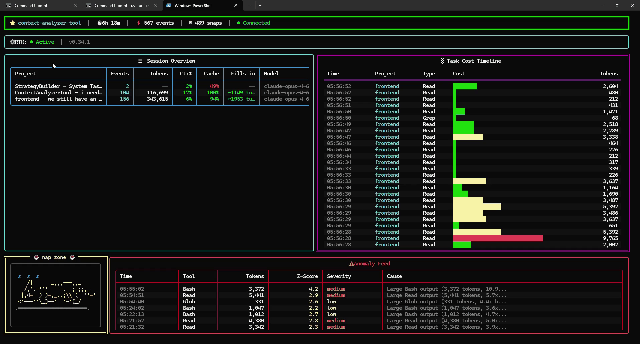
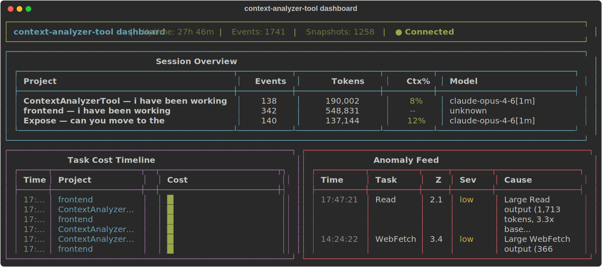

<p align="center">
  
</p>

<p align="center">
  <strong>Know exactly which tool call ate your context window.</strong>
</p>

<p align="center">
  <a href="https://github.com/roeimichael/ContextAnalyzerTerminal/actions/workflows/ci.yml"></a>
  <a href="https://www.python.org/downloads/"></a>
  <a href="LICENSE"></a>
  <a href="https://github.com/roeimichael/ContextAnalyzerTerminal/releases"></a>
  <a href="https://github.com/roeimichael/ContextAnalyzerTerminal/stargazers"></a>
  <a href="https://github.com/roeimichael/ContextAnalyzerTerminal/issues"></a>
</p>

---

Claude Code shows you total token usage -- but not *which* tool call caused the spike. Was it that `Bash` command that ran a find on your entire repo? The `Read` that loaded a 3,000-line file? CAT answers that question in real time.

It hooks silently into your Claude Code sessions, tracks token cost **per tool call**, builds rolling baselines, and fires an alert the moment something anomalous hits -- with a plain-language explanation of *why*.

<p align="center">
  
</p>

<p align="center">
  
</p>

## Quick Start

```bash
git clone https://github.com/roeimichael/ContextAnalyzerTerminal.git
cd ContextAnalyzerTerminal
uv sync                         # install deps (Python 3.11+ and uv required)
uv sync --extra classifier      # optional: LLM root-cause analysis (~$0.0001/event)

context-analyzer-tool install   # inject hooks into Claude Code
context-analyzer-tool serve     # start the collector (keep this running)
context-analyzer-tool dashboard # open the live TUI
```

That's it. Use Claude Code normally -- CAT tracks everything in the background.

## Why CAT?

Claude Code's built-in `/cost` and `/context` commands show snapshots -- no trends, no per-tool attribution, no cache TTL awareness. CAT fills that gap:

- You'll know which tool type consistently burns the most tokens in your workflow
- You'll get warned *before* your context fills, with actionable suggestions (`/compact`, `/clear`)
- You'll stop guessing and start optimizing

## What You Get

| Feature | What it does |
|:--------|:-------------|
| **Per-tool-call tracking** | See exactly how many tokens each Read, Bash, Grep, etc. costs |
| **Rolling baselines** | Learns normal cost per task type using Welford's algorithm |
| **Anomaly detection** | Flags tool calls that exceed baseline by configurable Z-score |
| **Root-cause analysis** | Haiku classifier explains *why* in plain language |
| **Context cost breakdown** | See fresh-session vs current overhead ratio |
| **Live dashboard** | Rich TUI with sessions, cost timeline, and anomaly feed |
| **Notifications** | Statusline badges, system alerts, Slack/Discord webhooks |
| **Multi-session** | Tracks concurrent Claude Code sessions independently |

## CLI Reference

```
context-analyzer-tool install         Install hooks into Claude Code
context-analyzer-tool uninstall       Remove hooks from Claude Code
context-analyzer-tool serve           Start the collector server
context-analyzer-tool dashboard       Launch the live TUI dashboard
context-analyzer-tool status          View active sessions and recent tasks
context-analyzer-tool anomalies       List recent anomalies with root causes
context-analyzer-tool context-cost    Show context cost breakdown
context-analyzer-tool health          Collector health check
context-analyzer-tool rtk-status      Show RTK integration status and savings
context-analyzer-tool prune           Clean up old data
context-analyzer-tool clear           Clear all stored data and start fresh
```

## Configuration

Config lives at `~/.context-analyzer-tool/config.toml` (created automatically on first `install`). Every setting can be overridden with environment variables using the `CAT_` prefix.

```toml
[collector]
host = "127.0.0.1"
port = 7821

[anomaly]
z_score_threshold = 2.0      # Std devs above mean to flag
min_sample_count = 5          # Data points before detection kicks in
cooldown_seconds = 60         # Debounce duplicate alerts

[classifier]
enabled = true                # Requires: uv sync --extra classifier
model = "claude-haiku-4-5-20251001"

[notifications]
statusline = true             # Badge in Claude Code statusline
system_notification = true    # OS notifications (macOS/Linux)
in_session_alert = true       # In-session alert messages
webhook_url = ""              # Slack/Discord webhook
```

Environment variable overrides:
```bash
CAT_COLLECTOR_PORT=8080
CAT_ANOMALY_Z_SCORE_THRESHOLD=3.0
CAT_CLASSIFIER_ENABLED=false
```

## How It Works

Claude Code hooks don't include token counts. CAT correlates two data streams:

1. **Hook events** (PostToolUse, SubagentStop, Stop, etc.) carry tool metadata
2. **Statusline snapshots** provide real-time token counts

The delta engine matches them by session ID + timestamps to compute per-call costs. Anomalies are detected via Z-score over a rolling 20-sample window per task type, then classified by Haiku.

```
Hooks + Statusline → Collector → Delta Engine → Anomaly Detection → Classifier → Notifications
                                       │
                                   SQLite DB
                                       │
                                   Dashboard
```

## Roadmap

- [ ] Web UI dashboard (browser-based alternative to TUI)
- [ ] Windows native notifications
- [ ] Per-file token attribution (which files you Read most)
- [ ] Export to CSV / JSON for external analysis
- [ ] pip installable package (`pip install context-analyzer-tool`)

Want to tackle one of these? Open an issue or check [CONTRIBUTING.md](CONTRIBUTING.md).

## Contributing

We welcome contributions! Check out our **[Good First Issues](https://github.com/roeimichael/ContextAnalyzerTerminal/labels/good%20first%20issue)** for beginner-friendly tasks with clear guidance.

```bash
uv sync --all-extras          # Install with dev + classifier deps
uv run pytest tests/ -v       # Run full test suite
uv run ruff check src tests   # Lint
uv run pyright                # Type check (strict mode)
```

See [CONTRIBUTING.md](CONTRIBUTING.md) for architecture overview, reading order, and contribution guidelines.

## Tech Stack

**FastAPI** + **Uvicorn** (async collector) -- **SQLite** + **aiosqlite** (persistence) -- **Pydantic** (validation) -- **Typer** + **Rich** (CLI/TUI) -- **Anthropic SDK** (optional classifier)

## License

[MIT](LICENSE)
